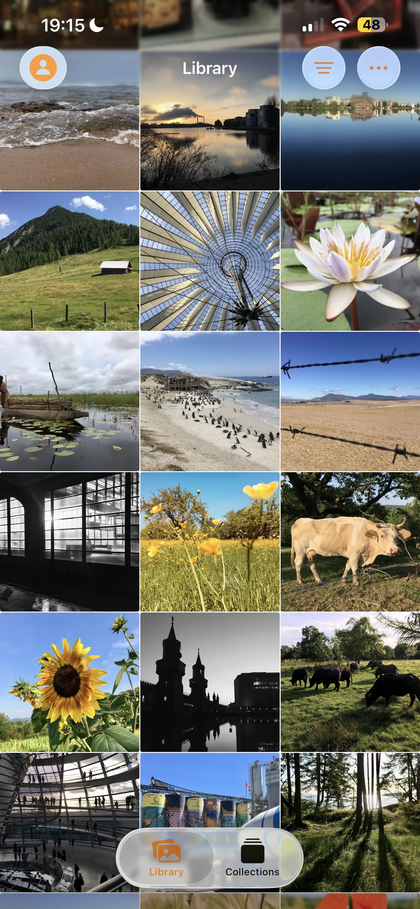
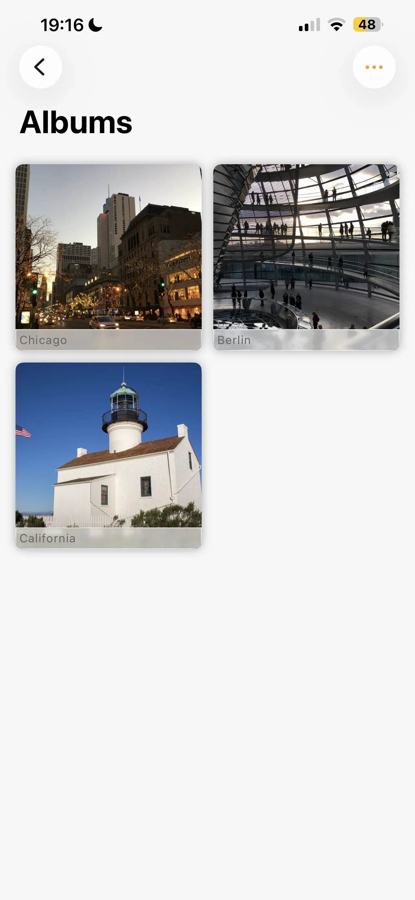
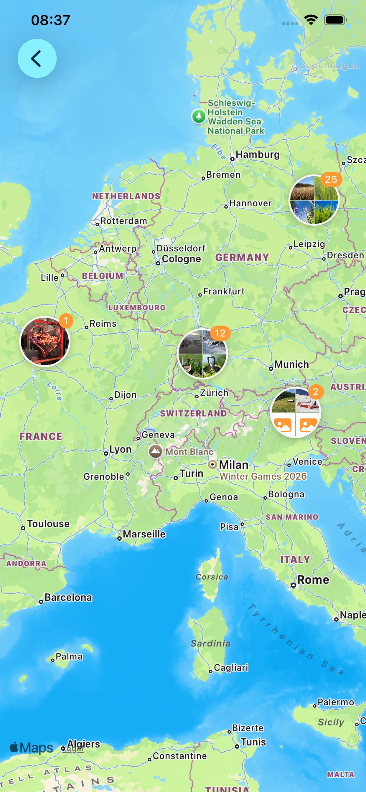
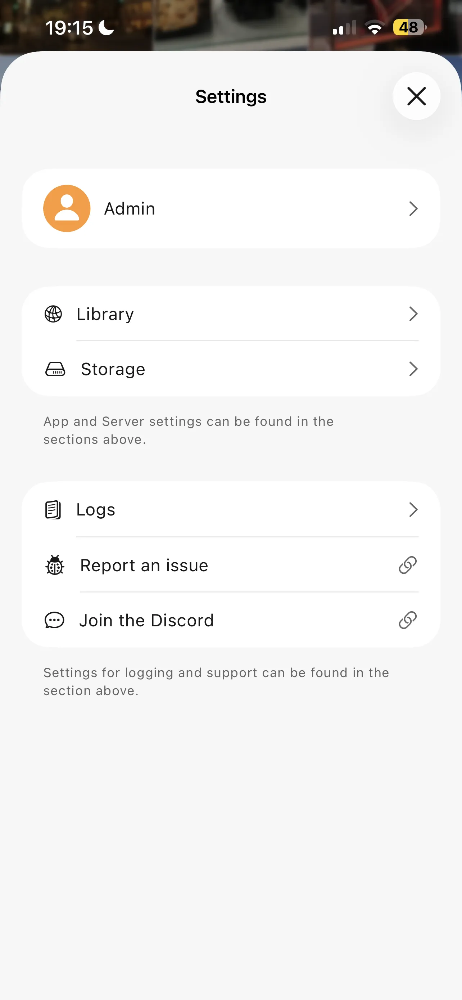
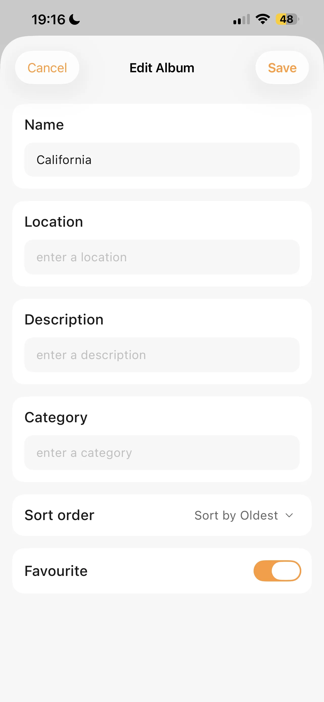

# Photoflare - PhotoPrism Client

Your Photos. Your Server. Your Privacy.

Photoflare is the premier native iOS client for PhotoPrism, the AI-powered open-source photo management platform. Access
your self-hosted photo library from anywhere with a beautifully designed, privacy-focused app built specifically for iPhone
and iPad.

## 📸 Browse Your Entire Library

Explore your photos and videos in a stunning, responsive grid that adapts to any screen size. Enjoy smooth scrolling through
  thousands of images with intelligent thumbnail caching that keeps everything fast and fluid.

## 🎬 Full Media Support

- Photos - View your images in full resolution with smooth zoom and pan
- Videos - Built-in video player with native controls
- Live Photos - Full Live Photo playback support, just like the Photos app

## 📁 Album Management

Create, edit, and organize albums directly from your device. Browse your existing collections, add photos to albums during
upload, and share albums with customizable share links.

## ⬆️ Easy Uploads

Upload photos and videos directly to your PhotoPrism server. Select from your photo library or import files, with real-time
progress tracking and automatic album assignment.

## 🔐 Secure Authentication

- Username & password login
- Two-factor authentication (2FA/OTP)
- OpenID Connect (OIDC) support
- Secure SSL/TLS connections

## 📴 Offline Mode

Download your photos for offline access. View your library anywhere, even without an internet connection. Smart caching
keeps your favorites ready when you need them.

## 🔄 Seamless Sync

Real-time synchronization keeps your library up-to-date via WebSocket connection. See new photos appear instantly as they're
  added to your server.

## 🎨 Beautiful Design

- Native SwiftUI interface
- Full Dark Mode support
- Haptic feedback for tactile interactions
- Customizable app icons

## Privacy

Photoflare connects directly to YOUR PhotoPrism server. Your photos never pass through our servers. Your data stays yours.

## Roadmap for V1

- [ ] Ability to Favourite photos.
- [ ] Add Favourites to Collections tab.
- [ ] Add Places to Collections tab.
- [ ] Make photo details, lense, location etc.. accessible via photo view.
- [ ] Add ability to zoom photos.
- [ ] Add multi select to images for bulk deletion/add to albums from photo library.
- [ ] Add ability to add photos to albums that are already in your library.
- [ ] Add ability to delete album AND all photos (currently photos are just removed)
- [ ] Add ability to view stacked photos.
- [ ] Add ability to archive photos/see archived photos.

## Screenshots

  
  
  
  

  
  
  

  
  
  

## Getting Started

1. Download Photoflare from the App Store or [TestFlight](https://testflight.apple.com/join/MMA6iQDl)
2. Enter your PhotoPrism server address
3. Log in with your credentials
4. Start browsing your photo library

## Reporting Bugs

Please use the [GitHub Issue Tracker](https://github.com/nicktsioros/photoflare_app/issues) to report any bugs or issues you encounter.

When reporting a bug, please include:
- Device model and iOS version
- App version
- Steps to reproduce the issue
- Any error messages you see

## Troubleshooting

### Beta: App crashes on launch

If you are using the Beta version and the app crashes when opening, please delete the app and re-install it from TestFlight.

## Requirements

- iOS 26.0 or later
- A PhotoPrism server instance

